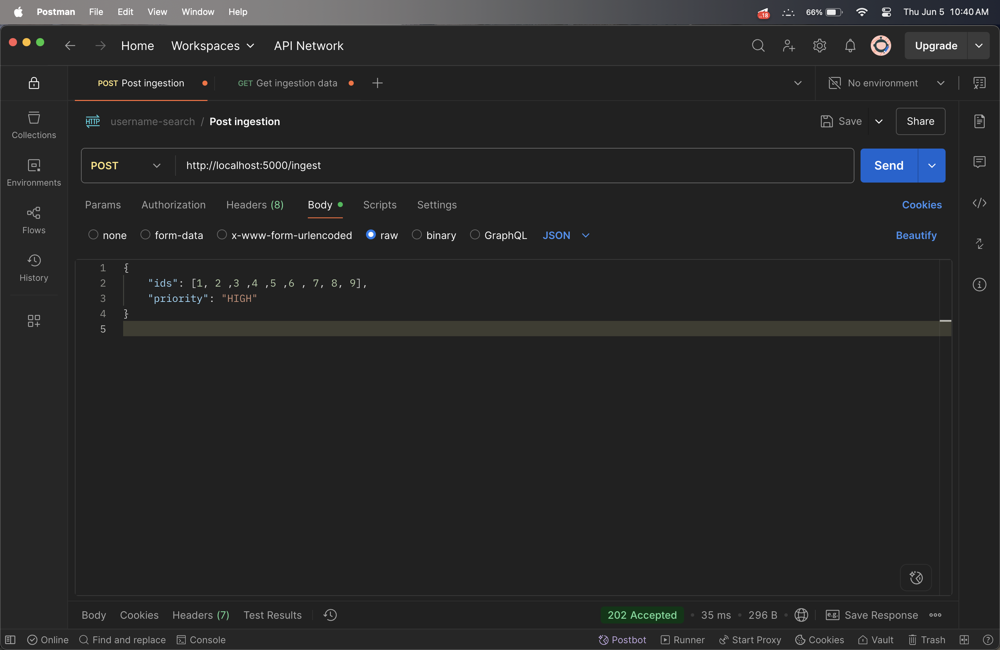
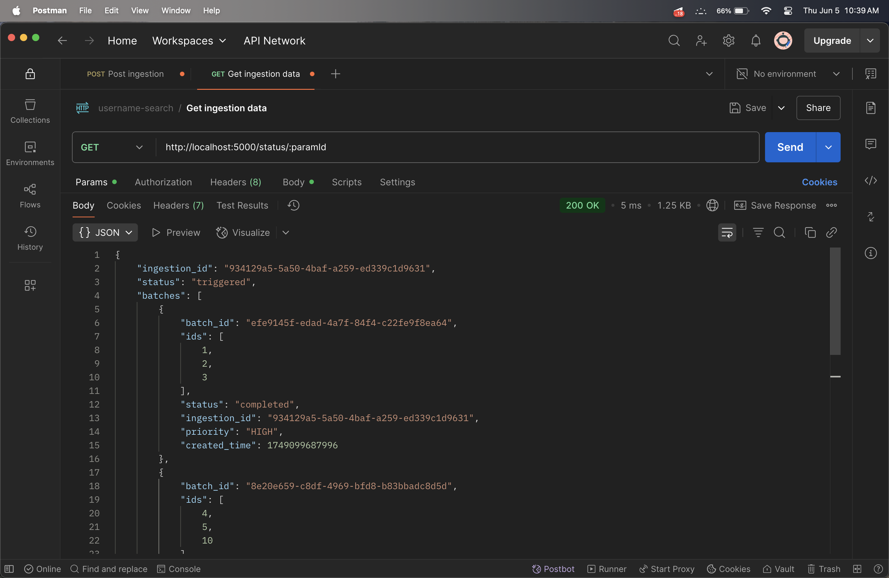
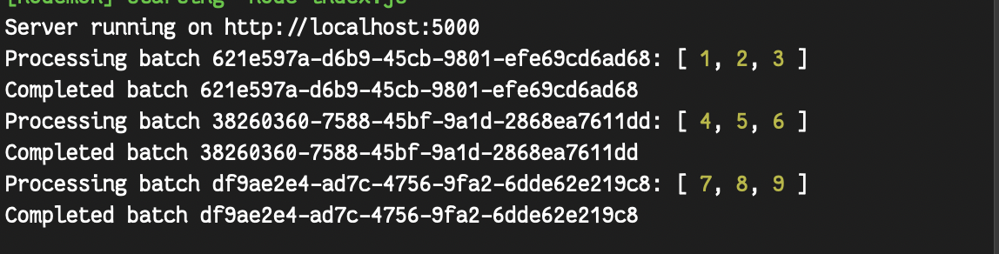

# Data Ingestion API System

A Node.js-based simulated API system designed to handle prioritized data ingestion jobs in batches with asynchronous processing and rate limiting.

---

## 🔧 Features

* **Ingestion API**: Accepts list of IDs with a given priority (HIGH, MEDIUM, LOW).
* **Status API**: Tracks the processing status of ingestion jobs.
* **Batch Processing**: Batches of up to 3 IDs processed asynchronously.
* **Rate Limiting**: Only one batch is processed every 5 seconds.
* **Priority-based Execution**: Higher-priority batches are always processed first.

---

## 📦 Tech Stack

* Node.js (Express)
* In-memory job queue
* UUID for unique ingestion and batch IDs

---

## 📁 Setup Instructions

### 1. Clone the Repository

```bash
git clone https://github.com/tomkndn/loop-ai-assignment.git
cd loop-ai-assignment
```

### 2. Install Dependencies

```bash
npm install
```

### 3. Start the Server

```bash
npm run dev
```

The server will run on: `http://localhost:5000`

---

## 🔌 API Endpoints

### 1. `POST /ingest`

Submits a data ingestion request.

#### Request Body

```json
{
  "ids": [1, 2, 3, 4, 5],
  "priority": "HIGH"
}
```

#### Response

```json
{
  "ingestion_id": "<uuid>"
}
```

---

### 2. `GET /status/:ingestion_id`

Fetches status of the specified ingestion job.

#### Response Example

```json
{
  "ingestion_id": "abc123",
  "status": "triggered",
  "batches": [
    { "batch_id": "uuid-1", "ids": [1, 2, 3], "status": "completed" },
    { "batch_id": "uuid-2", "ids": [4, 5], "status": "triggered" }
  ]
}
```

#### Batch Status Values

* `yet_to_start`
* `triggered`
* `completed`

#### Ingestion Status Logic

* `yet_to_start`: all batches not yet started
* `triggered`: at least one started but not all completed
* `completed`: all batches completed

---

### ✅ Example Test Input



---

### ✅ Example Test Output



---


### ✅ Example Test Response



---

## 📌 Design Choices

* **In-memory store**: Simpler setup for testing; can be swapped with Redis/DB.
* **Queue with sorting**: Ensures proper execution based on priority and time.
* **setInterval-based worker**: Simulates rate-limited background job execution.
* **UUIDs**: Uniquely identify ingestions and batches.

---
